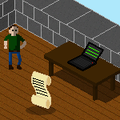
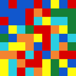

<ul class="links">
	<li>
		
	</li>
	<li>
		
	</li>
	<li>
		
	</li>
	<li>
		
	</li>
	<li>
		
	</li>
</ul>

## Game programming related

Most of those projects are proofs of concept, ideas, or partly finished games.

<ul class="projects">
	<li>
		
		<section>
			<h3>
				My interactive portfolio -
				<a class="block button" href="https://github.com/padawin/site" target="_blank">Github</a> -
				<a class="block button" href="http://ghislain-rodrigues.fr/interactive" target="_blank">
					URL
				</a>
			</h3>
			

				

				<b>Tech:</b>
				<ul>
					<li>Javascript and canvas</li>
					<li>Path finding</li>
					<li>Isometric calculations</li>
				</ul>
			

		</section>
		

	</li>
	<li>
		
		<section>
			<h3>
				Flood it -
				<a class="block button" href="https://github.com/padawin/floodit-clone" target="_blank">
					Github
				</a>
			</h3>
			

				

					Color puzzle game where the player has to fill the grid by
					changing the colors of the cells. Clone of an existing game.
					Also contains a timed mode and a multiplayer mode.
				

				<b>Tech:</b>
				<ul>
					<li>C, SDL2</li>
				</ul>
			

		</section>
		

	</li>
	<li>
		
		<section>
			<h3>
				rRPG -
				<a class="block button" href="https://github.com/rrpg/engine" target="_blank">
					Github
				</a>
			</h3>
			

				

					Text-based role playing game relying a lot on randomly
					generated content.
				

				<b>Tech:</b>
				<ul>
					<li>Python (compatible 2.7 and 3), C, SQLite3</li>
				</ul>
			

		</section>
		

	</li>
	<li>
		
		<section>
			<h3>
				Conqueror -
				<a class="block button" href="https://github.com/padawin/conqueror" target="_blank">
					Github
				</a>
			</h3>
			

				

					Strategy game where players must spread their pawns on a
					maximum of space to win
				

				<b>Tech:</b>
				<ul>
					<li>C</li>
				</ul>
			

		</section>
		

	</li>
	<li>
		
		<section>
			<h3>
				AD -
				<a class="block button" href="https://github.com/padawin/ad" target="_blank">
					Github
				</a>
			</h3>
			

				

					Puzzle game where the player must shift the rows and
					columns of a grid to group the cells per color
				

				<b>Tech:</b>
				<ul>
					<li>Javascript and canvas</li>
				</ul>
			

		</section>
		

	</li>
	<li>
		
		<section>
			<h3>
				adVenture -
				<a class="block button" href="https://github.com/padawin/adVenture" target="_blank">
					Github
				</a>
			</h3>
			

				

					Branched story game. At each step the player has to choose
					an action to go to the next step.
				

				<b>Tech:</b>
				<ul>
					<li>Javascript</li>
					<li>Engine of only 160bytes minimised!</li>
				</ul>
			

		</section>
		

	</li>
	<li>
		
		<section>
			<h3>
				Game framework -
				<a class="block button" href="https://github.com/padawin/game-framework-js" target="_blank">
					Github
				</a>
			</h3>
			

				

					Framework to make some grid based games.
				

				<b>Tech:</b>
				<ul>
					<li>Javascript and canvas</li>
					<li>Contains 3 demos: pong, race and adventure</li>
				</ul>
			

		</section>
		

	</li>
</ul>

### Demos and experiments

<ul class="projects">
	<li>
		
		<section>
			<h3>
				Ray tracing -
				<a class="block button" href="https://github.com/padawin/raytracing-test" target="_blank">
					Github
				</a>
			</h3>
			

				

					Demo of the implementation of a raytracing engine, with
					lights and obstacles to create some shadows.
				

				<b>Tech:</b>
				<ul>
					<li>Javascript and canvas</li>
				</ul>
			

		</section>
		

	</li>
	<li>
		
		<section>
			<h3>
				Particles -
				<a class="block button" href="https://github.com/padawin/particles" target="_blank">
					Github
				</a>
			</h3>
			

				

					Demo of the implementation of a particles engine.
				

				<b>Tech:</b>
				<ul>
					<li>Javascript and canvas</li>
				</ul>
			

		</section>
		

	</li>
</ul>
