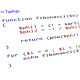

<ul class="links">
	<li>
		
	</li>
	<li>
		
	</li>
	<li>
		
	</li>
	<li>
		
	</li>
</ul>

## About me

My name is Ghislain Rodrigues, software engineer currently based in London, UK.
I love to code, as part of my job as well as a hobby. When I don't code, I like
to <a target="_blank" href="https://travels.ghislain-rodrigues.fr">travel and take photos</a>,
read, build Lego, meet up with friends and cook.

I like things well done, sharing what I know with people around me. People
around me say that I am an enthusiastic, curious person, who always looks for
new knowledge.

I am very interested in Game programming, created a <a target="_blank"
href="https://github.com/padawin/floodit-clone">small game</a> (clone of the
Floodit game) in C for the <a target="_blank"
href="http://www.gcw-zero.com/">GCW-Zero</a> console. I also have different
ongoing projects (most of them accessible on Github).

In 2018/2019, I followed an online course on Unity and created 4 <a href="./unity.html">2D games</a>.

For me, sharing information is invaluable and I am always happy to share what
I know and learn from people. At work, I regularly give workshops on advanced
features of Git, or about various programming topics. You can find my slides
<a target="_blank" href="http://slides.com/ghislainrodrigues-1">here</a>.

Have a look around, at my
<a href="https://ghislain-rodrigues.fr/CV-Ghislain-Rodrigues.pdf" target="_blank">CV</a>,
<a href="https://github.com/padawin" target="_blank">Github profile</a>
and
<a href="https://ghislain-rodrigues.fr/interactive" target="_blank">interactive
website</a>, and feel free to <a href="./contact.html">contact me</a>.

