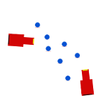

Welcome here, 
My name is Ghislain Rodrigues, programmer based in London. I love to code, it is my job, but a hobby too. 
My CV is downloadable <a target="_blank" href="http://ghislain-rodrigues.fr/CV-Ghislain-Rodrigues.pdf">here</a>. 
You can find most of my projects on <a target="_blank" href="https://github.com/padawin">Github</a>. 
You can also find me on <a target="_blank" href="https://uk.linkedin.com/pub/ghislain-rodrigues/45/68a/322">Linkedin</a>. 
If you want to read a bit more about me, you can do it <a href="./about.html">there</a>

## Tips and stuff

- [Migrate SVN branches to Git](./articles/migrate-SVN-branches-to-Git.html)
- [Double ssh tunnel](./articles/double-ssh-tunnel.html)
- [Quick search in Vim](./articles/quick-search-in-Vim.html)
- [Get a 1-dimension array of random elements from a 2-dimensions array](./articles/get-a-1-dimension-array-of-random-elements-from-a-2-dimensions-array.html)
- [Get the used memory in a program](./articles/get-the-used-memory-in-a-program.html)
- [SQL group query](./articles/sql-group-query.html)
- [Create a file in a non existing folder](./articles/create-a-file-in-a-non-existing-folder.html)
- [Javascript inheritance](./articles/javascript-inheritance.html)
- [Edit commit message](./articles/edit-commit-message.html)
- [Session share with tmux](./articles/session-share-with-tmux.html)
- [Of html semantic](./articles/of-html-semantic.html)
- [Checkout a commit in git based on a time in the past](./articles/checkout-a-commit-in-git-based-on-a-time-in-the-past.html)
- [Unnecessary elses](./articles/unnecessary-elses.html)
- [git add --interactive](./articles/git-add---interactive.html)
- [Search pattern to easily find conflicts in a file](./articles/search-pattern-to-easily-find-conflicts-in-a-file.html)
- [Format json output](./articles/format-json-output.html)
- [A way to write a method in a class](./articles/a-way-to-write-a-method-in-a-class.html)
- [Search and replace](./articles/search-and-replace.html)

## Game programming related

Most of those projects are proofs of concept, ideas, or partly finished games.

<ul class="thumbs">
	<li>
		<a class="block button large" href="https://github.com/rrpg/engine" target="_blank">
			
			rRPG
		</a>
	</li>
	<li>
		<a class="block button large" href="https://github.com/padawin/conqueror" target="_blank">
			
			Conqueror
		</a>
	</li>
	<li>
		<a class="block button large" href="https://github.com/padawin/ad" target="_blank">
			
			AD
		</a>
	</li>
	<li>
		<a class="block button large" href="https://github.com/padawin/adVenture" target="_blank">
			
			adVenture
		</a>
	</li>
	<li>
		<a class="block button large" href="https://github.com/padawin/game-framework-js" target="_blank">
			
			Game framework
		</a>
	</li>
	<li>
		<a class="block button large" href="https://github.com/padawin/raytracing-test" target="_blank">
			
			Ray tracing
		</a>
	</li>
	<li>
		<a class="block button large" href="https://github.com/padawin/particles" target="_blank">
			
			Particles
		</a>
	</li>
</ul>
